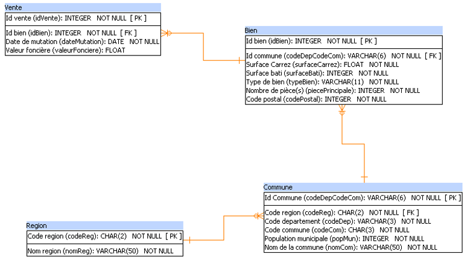

# Analyse de données immobilières avec SQL

## Objectif
Créer une base de données relationnelle permettant d’analyser et d’exploiter les données de ventes immobilières.

---

## Travail réalisé
- Préparation et structuration de données issues de fichiers Excel
- Transformation de données en tables CSV exploitables
- Création d’un dictionnaire de données pour documenter la structure de la base
- Conception d’un modèle relationnel avec Power Architect
- Organisation des entités métier et définition des relations entre tables
- Création et déploiement d’une base de données SQL
- Vérification de l’intégrité des tables et des relations
- Import et gestion des données dans un environnement SQL
- Écriture de requêtes SQL pour l’analyse de données immobilières
- Exploration et analyse de données via SQL Workbench

---

## Schéma relationnel normalisé

## Requêtes SQL
Les requêtes utilisées sont dans le fichier *requetes (SQL)*

---

## Outils
- SQL
- MySQL / SQL Workbench
- Power Architect
- Excel

---

## Résultats
- Analyse des ventes immobilières
- Exploration des tendances du marché
- Extraction d’indicateurs clés

---

## 👤 Auteur
Yoann De Cler
